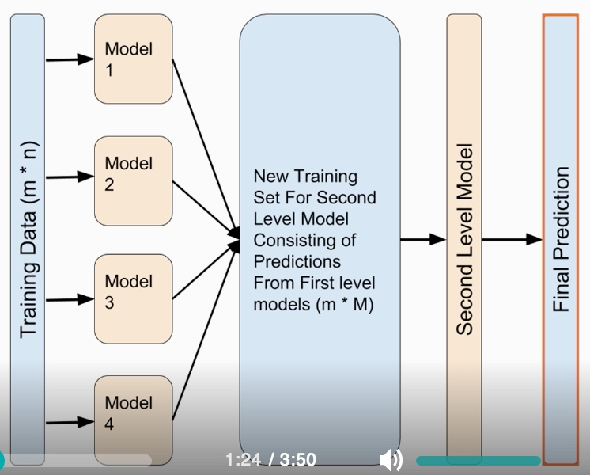

# Ensemble Learning Techniques

- [Summary](#Summary)
- [Bagging](#Bagging)
- [Boosting](#Boosting)
- [Stacking](#Stacking)
- [Spark](#Spark)

## Summary

- Ensemble learning reduces variance. The aggregate opinion of many models is less noisy than a single opinion of one of the models.
- Can be used for classiication and regression
- Some of the ensemble learning techniques are
  - Averaging
    - Weighted averaging: Models are assigned different weights depending on the importance of each model for prediction
  - Voting
    - 2 voting techniques
      1. Hard
      2. Soft
    - Weighted majority vote
  - Bootstrap Aggregation (or Bagging)
  - Boosting
  - Stacking

## Bagging

### Bootsrapping

- Is a sampling technique
- We create subsets of observations from the original dataset
- We use sampling with replacement (means a given observation can be included in a given small sample more than once)
- Works *best for highly non-linear modles like decision trees*

Bagging (short for Bootstrap Aggregating) is ensemble technique that uses bootsrap method to models.

### Mechanics

1. Bootstrapping is used to create multiple subsets from the original dataset
2. A base model is created on each subset
3. The models run independently in parallel on different subsets
4. We then combine the predictions from all the models to get the final prediction

### Random Forest

- Operate by constructing a multitude of decision trees at training time and outputting the class that is mode of the classes (classification) or mean prediction (regression) of the individual trees
- Random decision forests correct for decision tree's habit of overfitting to their training set
- Works surprisingly well even with almost no data preparation or mdeling expertise
- Advantages
  - Can handle large dataset with high dimensionality
  - Ouputs importance of variable that can be used to reduce the dimensionality
  - Can handle missing values gracefully
  - Can handle datasets where classes are imbalanced
  - Can be used in unsupervised clustering and outlier detection

## Boosting

We combine *weak classifiers* to get a more complext model with the help of **boosting**. Example boosting algorithms

- AdaBoost
- Gradinet boosting (Works for classification & regression)
- XGBoost (EXtreme Gradient Boosting)
  - Uses regularization to prevent overfitting
  - Also known as regularized boosting technique
  - Implements parallel processing
  - Allows users to define custom optimization objectives
  - Handles missing values using built-in functions
  - Implements tree pruning and prevents overfitting
- LightBGM
  - Performs well with extrememly large dataset
  - Uses tree-based algorithms like DT
- Catboost
  - Can automatically deal with categorical variables
  - Doesn't require extensive data preprocessing

*AdaBoost* is an example of a boosting algorithm. For AdaBoost, ee need to:

- calculate model coefficients. The good model will have more weight.
- claculate data weights

### Weak classifier

- perform only slightly better than a random classifier
- usually have low variance
- usually are fast learners
- Examples
  - Logistic regression with simple features
  - Shallow decision trees
  - Decision stumps

## Stacking

Invloves *training a learning algorithm* **to combine the predictions of several other learning algorithms**.

### Blending

## Spark

- Supports two major ensemble algorithms: `GradientBoostedTrees` and `RandomForest`. Both use decision trees as their base models.
- [XGBoost on Spark](https://xgboost.readthedocs.io/en/latest/jvm/xgboost4j_spark_tutorial.html)